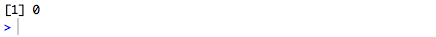
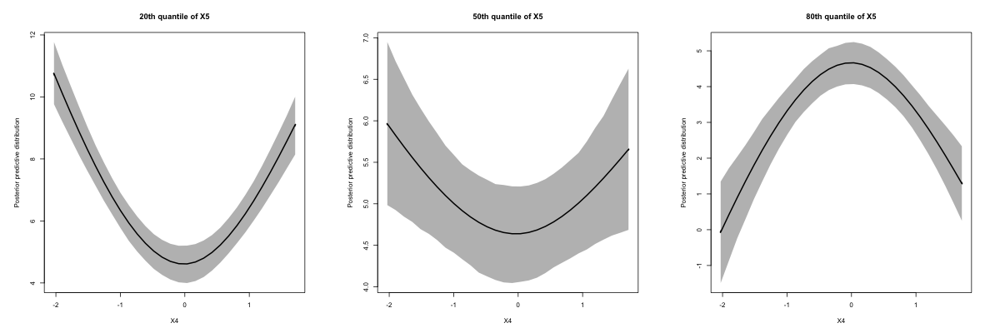
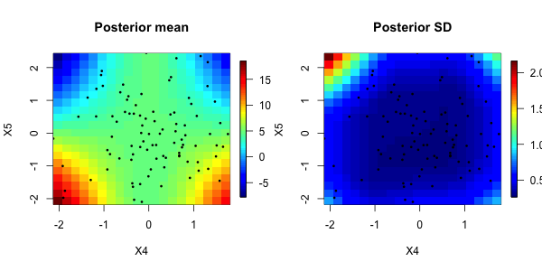
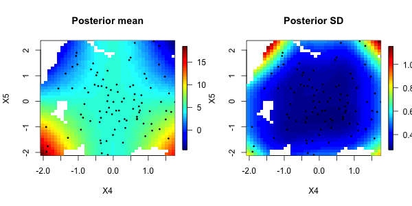

# NLinteraction

This is an R package to implement the ideas in Antonelli et. al (2018) to estimate the effects of environmental mixtures that allows for interactions of any order among the interactions. More details can be found at the following link:

https://arxiv.org/pdf/1711.11239.pdf

Please don't hesitate to contact Joseph Antonelli with any questions at jantonelli111@gmail.com. Please report any bugs if you encounter any as well!

# How to use NLinteraction

The first thing we need to do is install the library, which can be done using the following

```
library(devtools)
install_github(repo = "jantonelli111/NLinteraction")
library(NLinteraction)
```

So let's generate some data that we can use to illustrate the different functionalities in the package:

```
n = 100
p = 10
pc = 1

X = matrix(rnorm(n*p), n, p)

C = matrix(rnorm(n*pc), nrow=n)

TrueH = function(X) {
  return(1.5*(X[,2]*X[,3]) - 1.6*(X[,4]^2 * X[,5]))
}

Y = 5 + C + TrueH(X) + rnorm(n)
```

So we've generated p=10 exposures that are of interest for this software, one additional covariate that we control for (typically demographic variables, etc.), and an outcome conditional on both of these things. We see that the true relationship between X and Y is nonlinear as there is a squared term. We have intentionally chosen strong signals for this illustration, so that we can clearly see in all of the plots what is happening.

### Main MCMC function

Now we will build our model. The first thing to note is that the number of degrees of freedom of the splines in the model is very important and therefore the model should be built for a few different values of the degrees of freedom and then the WAIC can be used to evaluate which model to proceed with. Here we will choose 2 and 3 degrees of freedom. Degrees of freedom is controlled by the ns parameter in the model. We also must select the number of MCMC iterations we want (nIter), the number to throw out with the burn-in (nBurn), how many samples to thin (thin), and how many chains to run (nChains). Other parameters that control things such as the hyperparameters of the prior distributions in the model can be changed as well, but we recommend using the pre-set values unless their is strong prior information and the user fully understands the prior distributions.

```
NLmod2 = NLint(Y=Y, X=X, C=C, nIter=1000, nBurn=500, thin=2, nChains=2, ns=2)
NLmod3 = NLint(Y=Y, X=X, C=C, nIter=1000, nBurn=500, thin=2, nChains=2, ns=3)
```

So we can now evaluate the WAIC of each model

```
print(c(NLmod2$waic,NLmod3$waic))
```


And we see that the 2 degree of freedom model is preferred so we will continue with inference using that model. Let's call this model NLmod

```
NLmod = NLmod2
```

### Posterior inclusion probabilities

One quantity of interest is the posterior probability that each exposure enters into the model (regardless of the order of interaction). This can be extracted with the following object:

```
NLmod$MainPIP
```


and we can easily visualize them.

```
barplot(NLmod$MainPIP)
```


We can also look at the matrix of two-way interaction probabilities.

```
NLmod$InteractionPIP
```


We have a built-in function to plot the two-way posterior inclusion probabilities

```
plotInt(NLmod = NLmod)
```


We can also calculate any order interaction we want using the following function

```
InteractionProb(NLmod=NLmod, Xsub=c(4,5,9))
```



Which shows that the posterior inclusion probability of a three-way interaction between X4, X5, and X9 is 0. This function can be used to calculate any order interaction, and the order is dictated by the length of Xsub. If Xsub were to instead be simply a scalar, this function would return the marginal inclusion probabilities we first looked at. 

### Visualizing exposure response surfaces

Now that we know which exposures are important for predicting the outcome, we can visualize the associations that our model has identified. There are a number of plotting techniques to do this built into the function and we detail them here. The first function plots 1-dimensional exposure response curves between an exposure of interest and the outcome, while fixing the values of the other exposures. Specifically, the function allows the user to fix the value of one exposure at a given quantile, while the remaining exposures are fixed to a different specific quantile. The reason for doing this is that we might want to see how these curves change as a function of another exposure, if two exposures are interacting. In our example there is an interaction between X4 and X5, so we will plot X4's relationship with the outcome, but at different levels of X5, while fixing the values of the remaining exposures.

```
par(mfrow=c(1,3), pty='s')
plotSurface1d(NLmod = NLmod, X=X, C=C, j1=4, j2=5,
              gridLength=30, quantile_j2=0.2, quantile_rest = 0.5,
              xlab="X4", ylab="Posterior predictive distribution",
              main="20th quantile of X5")
plotSurface1d(NLmod = NLmod, X=X, C=C, j1=4, j2=5,
              gridLength=30, quantile_j2=0.5, quantile_rest = 0.5,
              xlab="X4", ylab="Posterior predictive distribution",
              main="50th quantile of X5")
plotSurface1d(NLmod = NLmod, X=X, C=C, j1=4, j2=5,
              gridLength=30, quantile_j2=0.8, quantile_rest = 0.5,
              xlab="X4", ylab="Posterior predictive distribution",
              main="80th quantile of X5")

```



We see that the curves look dramatically different at different values of X5, since they have a strong interaction with each other. We fixed the remaining exposures at their median (quantile_rest = 0.5), though results do not change if we change this parameter, because X4 doesn't interact with any other variables. 

While it is illustrative to see the curves for one dimension at a time, it is also of interest to explore the full bivariate relationship between two exposures. Again we will stick with X4 and X5 and use the following function:

```
par(mfrow=c(1,2), pty='s')
plotSurface2dMean(NLmod = NLmod, X=X, C=C, j1=4, j2=5,
              gridLength_j1=20, gridLength_j2 = 20,
              quantile_rest = 0.5, xlab='X4', ylab='X5',
              main="Posterior mean")
points(X[,4], X[,5], pch=16, cex=0.5)
plotSurface2dSD(NLmod = NLmod, X=X, C=C, j1=4, j2=5,
                  gridLength_j1=20, gridLength_j2 = 20,
                  quantile_rest = 0.5, xlab='X4', ylab='X5',
                  main="Posterior SD")
points(X[,4], X[,5], pch=16, cex=0.5)
```



The left panel is the posterior mean and the right panel is the pointwise posterior SD. The black dots are the observed data points. Notice that there are blocks in the figure, which come from the fact that we discretized the space in a grid, and the grid length is controlled by gridLength_j1 and gridLength_j2. We can double it and see that the plot becomes more smooth. Generally the plot will look nicer for larger grid lengths, however, it takes a bit longer to calculate, since we have to calculate the posterior predictive distribution at more points.

```
plotSurface2dMean(NLmod = NLmod, X=X, C=C, j1=4, j2=5,
                  gridLength_j1=40, gridLength_j2 = 40,
                  quantile_rest = 0.5, xlab='X4', ylab='X5',
                  main="Posterior mean")
points(X[,4], X[,5], pch=16, cex=0.5)
plotSurface2dSD(NLmod = NLmod, X=X, C=C, j1=4, j2=5,
                gridLength_j1=40, gridLength_j2 = 40,
                quantile_rest = 0.5, xlab='X4', ylab='X5',
                main="Posterior SD")
points(X[,4], X[,5], pch=16, cex=0.5)
```


Finally, in some areas of the figure there isn't a lot of data and any predictions we make in that region effectively amount to extrapolation. If the user does not want to do this, then they can set the minDist option to the value such that points in the grid without observed data points within minDist of them are excluded in the figure. We can see that here:

```
par(mfrow=c(1,2), pty='s')
plotSurface2dMean(NLmod = NLmod, X=X, C=C, j1=4, j2=5,
                  gridLength_j1=40, gridLength_j2 = 40,
                  quantile_rest = 0.5, xlab='X4', ylab='X5',
                  main="Posterior mean", minDist=0.5)
points(X[,4], X[,5], pch=16, cex=0.5)
plotSurface2dSD(NLmod = NLmod, X=X, C=C, j1=4, j2=5,
                gridLength_j1=40, gridLength_j2 = 40,
                quantile_rest = 0.5, xlab='X4', ylab='X5',
                main="Posterior SD", minDist=0.5)
points(X[,4], X[,5], pch=16, cex=0.5)
```



**References**

Joseph Antonelli, Maitreyi Mazumdar, David Bellinger, David C. Christiani, Robert Wright, Brent A. Coull. **Estimating the health effects of environmental mixtures using Bayesian semiparametric regression and sparsity inducing priors**. 2019. The Annals of Applied Statistics. To appear.
